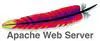

# Deliverable 1

## Concepts I don't understand:

**Apache**-Apache is a free and open-source software that allows users to deploy their websites on the internet. 

**UFW firewall**-Uncomplicated Firewall (UFW) is a program for managing a net filter firewall designed to be easy to use.

**systemd**-Systemd is a software for Linux that organizes how a computer starts up, manages different tasks it needs to do, and controls how programs run on the system.

**systemctl**-Manage services, control processes, and handle system functions like starting and stopping services or checking their status.

**a2ensite**-a2ensite  is  a  script  that  enables  the specified site  within the apache2  configuration. 

## Answer The following questions:

## What is a web server? Hardware and software side

On the hardware side, a web server is a computer that stores web server software and a website's component files.On the software side, a web server includes several parts that control how web users access hosted files.

## What are some different web server applications?

Apache

The Apache HTTP Server  is a free and open-source cross-platform web server software, released under the terms of Apache License 2.0.

Nginx

NGINX is open source software for web serving, reverse proxying, caching, load balancing, media streaming, and more.

Lighthttpd

Lighttpd is open-source web server software. It’s designed specifically for environments with limited resources since it consumes minimal CPU and RAM. It’s also suitable for both the Windows and Linux Operating Systems (OSs):

## What is virtualization?

Virtualization is a process that allows for more efficient utilization of physical computer hardware and is the foundation of cloud computing.

## What is virtualbox?

VirtualBox is a tool for virtualizing x86 and AMD64/Intel64 computing architecture for business and personal use.

## What is a virtual machine?

A Virtual Machine (VM) is a compute resource that uses software instead of a physical computer to run programs and deploy apps. 

## What is Ubuntu Server?

Ubuntu Server is a part of the larger set of Ubuntu products and operating system developed by Canonical Ltd. Ubuntu server is a specific addition that differs a little bit from Ubuntu desktop, in order to facilitate installation on servers.

## What is a firewall?

A firewall is a network security device that monitors incoming and outgoing network traffic and decides whether to allow or block specific traffic based on a defined set of security rules.

## What is SSH?
SSH, also known as Secure Shell or Secure Socket Shell, is a network protocol that gives users, particularly system administrators, a secure way to access a computer over an unsecured network.
