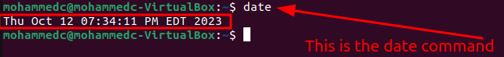
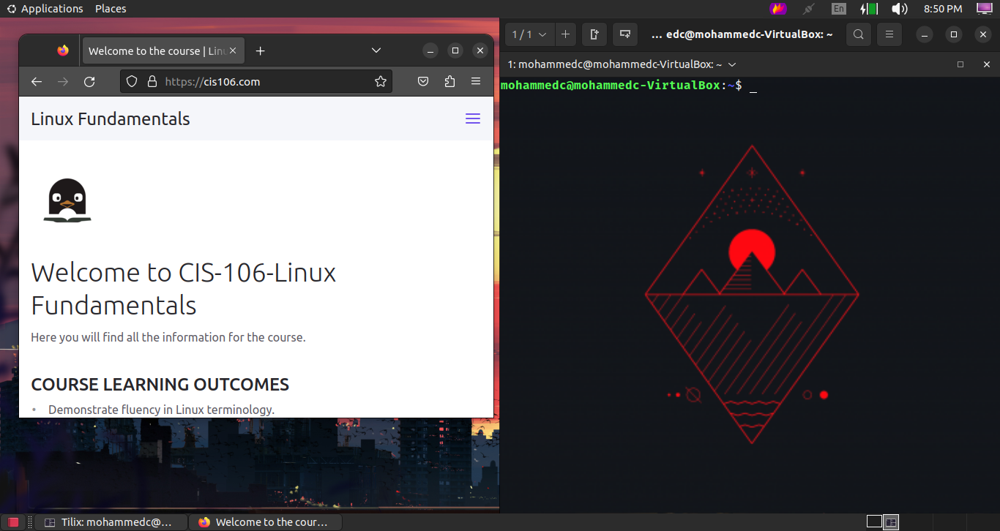

# Lab 3 Submission

## Question 1 

## Question 2

## Question 3

| Program purpose     | Package Name     | Version            |
| ------------------- | ---------------- | ------------------ |
| Play a tetris game  | blockattack      | 2.7.0.1            |
| Play a video file   | dragonplay       | 4:21.12.3-0ubuntu1 |
| Browse the internet | epiphany-browser | 42.4-oubuntu1      |
| Read your email     |                  |                    |
| Play music          |                  |                    |

## Question 4
![q4]
| command | what it does                                                   |
| ------- | -------------------------------------------------------------- |
| echo    | display a line of text                                         |
| fortune | print a random, hopeful interesting, adage                     |
| cowsay  | print or set the system date and time                          |
| lolcat  | rainbow coloring effect for text consol display                |
| figlet  | display large characters made up of ordinary screen characters |
| toilet  | display large colorful characters                              |
| rig     | random identity generator                                      |