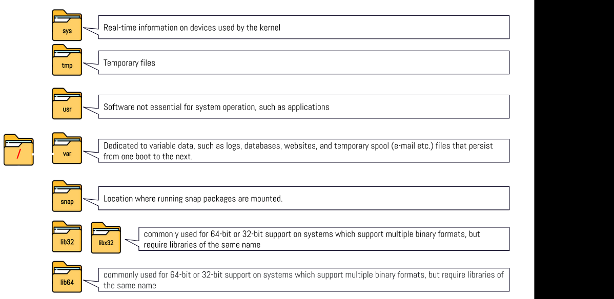

# Week Report 4

## Practice from the presentation The Linux File system:

### Practice 1

### Practice 2

### Practice 3

## The Linux File system directories and their purpose:

 
 
 

## All the commands for navigating the filesystem

| Command | What it does                                               | Syntax | Example      |
| ------- | ---------------------------------------------------------- | ------ | ------------ |
| pwd     | used for displaying the current working directory          | pwd    | 'pwd'        |
| cd      | used for changing the current working directory            | cd     | cd Downloads |
| ls      | used for displaying all the files inside a given directory | ls     | ls -a        |
## Basic terminology 

**File system**- The way files are stored and organized.

**Current directory**- The directory where you are at the moment is called current directory.

**parent directory**- Where you can move forward to a subdirectory or backwards to the previous directory.

**the difference between your home directory and the home directory**
 The difference is that home directory meaning your specific folder on your computer and The home directory does not mention specific folder.

**pathname**- Every file has a pathname which indicates the location of the file in the filesystem like an address.

**relative path**- The location of a file starting a the root of the file system.

**absolute path**- The location of a file from the current working directory that is located inside the current working directory.

