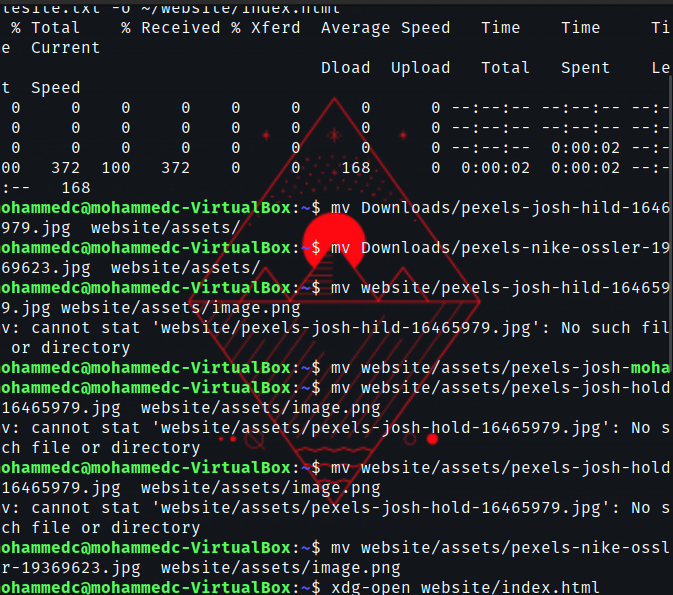
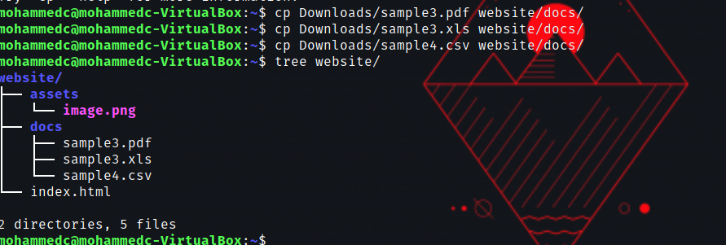

# Week Report 5

**What are Command Options?**
That modify or enhance their behavior.
**What are Command Arguments?**
Which are the items the commands acts on.
**Which command is used for creating directories? Provide at least 3 examples.**
mkdir is used for creating directories.
Example 1: "mkdir red"
Example 2: mkdir pictures/sunset
Example 3: mkdir pictures/" john's car"

**What does the touch command do? Provide at least 3 examples.**
touch is used for creating files
Example 1: touch cars
Example 2: touch ~/Pictures/Venice.txt
Example 3: touch Pictures/Vacation.txt

**How do you remove a file? Provide an example.**
To remove a file use a command rm
Example: rm cars

**How do you remove a directory and can you remove non-empty directories in Linux? Provide an example**
To remove a directory you can use command rmdir , yes you can remove a non-empty directories in Linux 
Example: rm -r Pictures/Venice

**Explain the mv and cp command. Provide at least 2 examples of each**
mv- moves and renames directories.
cp- cp copies files/directories from a source to a destination.

mv example
example 1: mv Downloads/homework.pdf Documents/
example 2: sudo mv ~/Downloads/theme /usr/share/themes

cp example
example 1: cp Downloads/Wallpapers.zip Pictures/
example 2: cp -r ~/Downloads/wallpapers ~/Pictures/

### Practices in the Presentation

Practice 1

