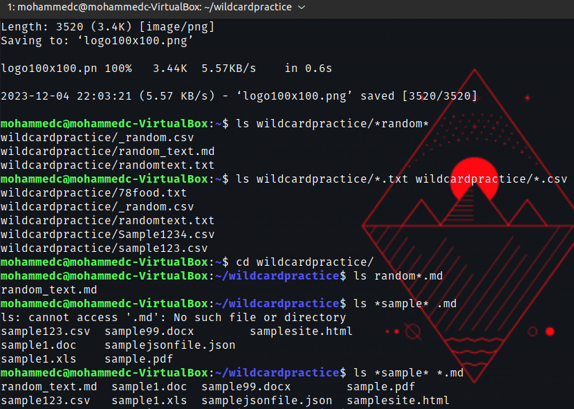
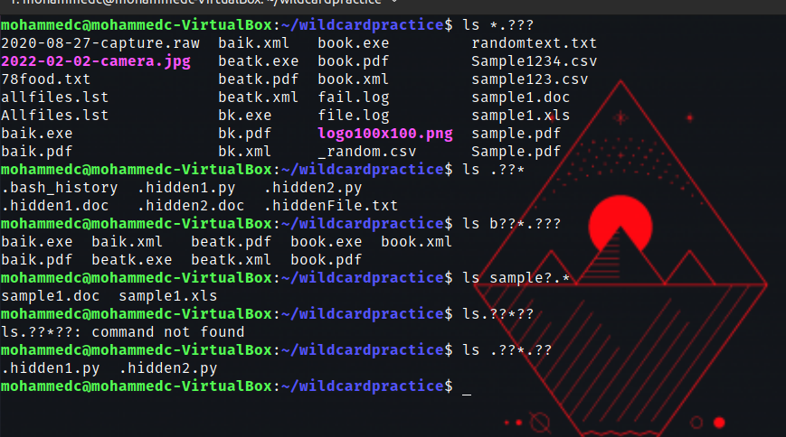
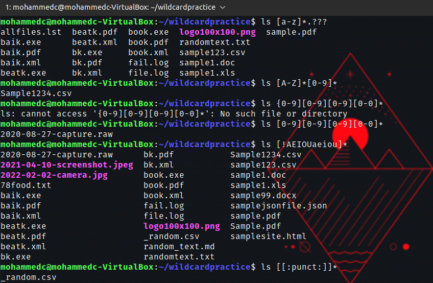

# Week Report 6

## Wildcards

The *Wildcard matches from 0 to any number of characters.

Lists all the files that end in .txt
example ls*.txt
ls *.txt* pdf list all the files that end in .txt and .pdf
ls *file.* list all the files that have any letter before the string"file."
## The ? Wildcard 
The ? Wildcard matches precisely one character.
example1: ls ./.??* List all the hidden files in the current directory
example2: ls../.??* List all the hidden files in the parent directory
example3: ls *.??? list all the files that have a 3 letter file extension

## The [] Wildcard
The [] Wildcard matches a single character in a range.
Example1:To match all files that have a vowel after letter f. ls f[aeiou]*
Example2: To match all files that do not have a vowel after letter f. ls f[!aeiou]*
Example3: To match a;; files whose name has at least one number: ls*[0-9].*

### practice in the presentation

Practice 5

Practice 6

Practice 7

**Brace expansion and how to use it. At least 3 examples**
Brace expansion allows you to generate arbitrary strings to use with commands.
Example 1:
To create a whole directory structure in a single commands mkdir -p music/{jazz,rock}/{mp3files,videos,oggfiles}new{1..3}
Example 2 and 3: to create a N number files use: touch website {1..5}.html 
touch file{A..Z}.txt
